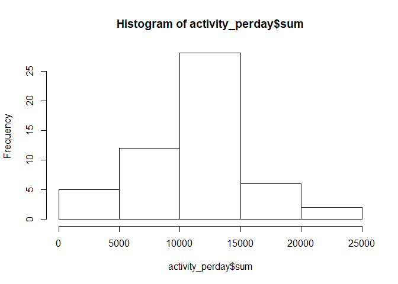
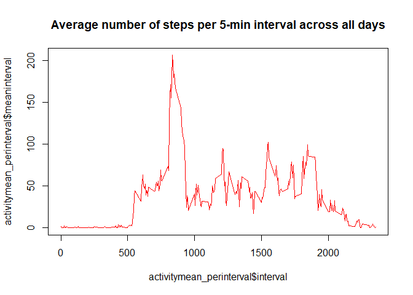
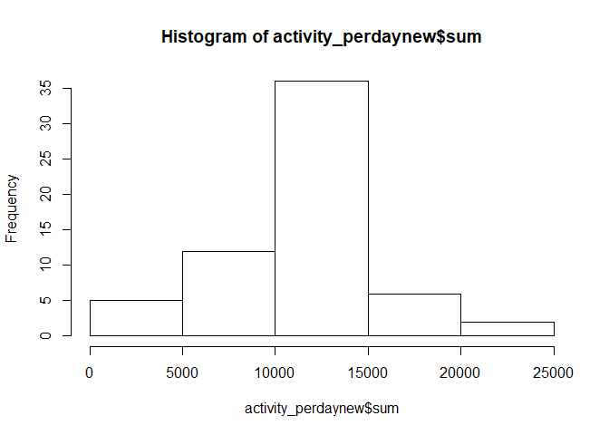
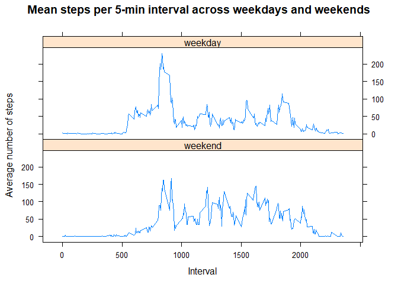

##Description of Dataset
This assignment uses the "Activity monitoring dataset". This dataset uses data from  
a personal activity monitoring device which collects data on number of steps taken by 
an individual in 5 minute intervals each day for a period of two months from October 
through November, 2012.This dataset has 17,568 observations. 

###Variables included in dataset
* steps: Number of steps taken per 5-minute interval (missing values are coded as NA)
* date: The date on which the measurement was taken in YYYY-MM-DD format
* interval: Identifier for the 5-minute interval in which measurement was taken

Setting working directory, getting the working directory and listing the files in it.  

```r
knitr::opts_chunk$set(echo = TRUE)
setwd("C:/Users/nithyak/Desktop/COURSERA/Reproducible_Research/Wk_2/Peer_Assessment_Assignment_1")
getwd()
```

```
## [1] "C:/Users/nithyak/Desktop/COURSERA/Reproducible_Research/Wk_2/Peer_Assessment_Assignment_1"
```

```r
list.files()
```

```
## [1] "~$structions.docx"  "~WRL1528.tmp"       "activity.csv"      
## [4] "PA_1.R"             "PA1_template.html"  "PA1_template.md"   
## [7] "PA1_template.Rmd"   "PA1_template_files"
```

**1) Read in the dataset**

```r
activity <- read.csv("activity.csv")
View(activity)
names(activity)
```

```
## [1] "steps"    "date"     "interval"
```

**Processing the data & Calculating total number of steps taken each day**

```r
library(dplyr)
```

```
## 
## Attaching package: 'dplyr'
```

```
## The following objects are masked from 'package:stats':
## 
##     filter, lag
```

```
## The following objects are masked from 'package:base':
## 
##     intersect, setdiff, setequal, union
```

```r
activity_new <- activity %>% group_by(date) %>% summarise(sum = sum(steps, na.rm = TRUE))
View(activity_new)
```
*Sum column of **activity_new dataframe** shows the total number of steps taken per day *

**2) Making a histogram of the total number of steps taken each day**

```r
hist(activity_new$sum)
```

<!-- -->

**3) Calculating the mean and median of total number of steps taken per day**

```r
activity_newmean <- activity %>% group_by(date) %>% summarise(mean = mean(steps, na.rm = TRUE))
View(activity_newmean)
activity_newmedian <- activity %>% group_by(date) %>% summarise(median = median(steps, na.rm = TRUE))
View(activity_newmedian)
```


**4) To make a time series plot of the average number of steps taken across days by interval (mean1),**
**we calculate mean1 first for a total of 288 intervals**

*Average number of steps taken across days by interval (mean1)*

```r
activity_newmean1 <- activity %>% group_by(interval) %>% summarise(mean1 = mean(steps, na.rm = TRUE))
View(activity_newmean1)
```
*mean1 column of **activity_newmean1 dataframe** shows the average number of steps taken per day*


*Plot with x axis = 5 minute interval; y axis = mean1 (average number of steps taken,*
*averaged across all days)*

```r
plot(activity_newmean1$interval, activity_newmean1$mean1, type = "l", col = "red", main = "Average number of steps per 5-min interval across all days")
```

<!-- -->

*This time series plot shows the average number of steps taken across all days(61 days) by interval**
**and there is a peak (>200 steps on an average) between intervals:500 to 1000*


**5) Finding the 5-minute interval that, on average, contains the maximum number of steps**

```r
  which.max(activity_newmean1$mean1)
```

```
## [1] 104
```

```r
  act <- activity_newmean1[104,]
  ans <-act$interval
```
*The 5-minute interval that contains maximum number of steps is 835*

**6) Coding to describe and show a strategy for imputing missing data**  

To calculate the total number of missing values in the dataset (i.e. the total number of rows with NAs),
we can code to find out the total number of rows without NAs as follows.

```r
  activitysubset <- subset(activity, steps != "NA")
```
*We have 15,264 rows with observations without NA values. Therefore, we have 2,304 rows with NAs*
  
  
**Devising a strategy for filling in all of the missing values in the dataset**  

*First split dataset into two: one with only NAs and one without NAs*

```r
  activityNA <- activity[rowSums(is.na(activity)) > 0,]
  View(activityNA)
```
*activityNA dataframe has 2,304 observations.*


```r
  activitynotNA <- activity[rowSums(is.na(activity)) == 0,]
```
*activitynotNA dataframe has 15,264 observations.*


*Merge activityNA dataframe (has 2304 rows with NAs only) and activity_newmean1*
*dataframe using interval variable common to both datasets* 

```r
  mergeddata <- merge(activityNA, activity_newmean1, by.x = "interval", by.y = "interval")
```
  
  
*Replace NAs in mergeddata*
Using ifelse function we use a logical object(is.na()) to replace NAs in steps variable of mergeddata dataframe

```r
  mergeddata$steps <- ifelse(is.na(mergeddata$steps), mergeddata$mean1 , mergeddata$steps)
```
 
  
*Select only the 1st three columns after imputing: steps, date, interval*

```r
  mergeddata1 <- select(mergeddata, interval, steps, date)
```

  
*Round the steps variable*

```r
  mergeddata1$steps <- round(mergeddata1$steps)
```

  
*Create new dataset = original dataset with imputed values- rbind*

```r
  activity_new1 <- rbind(mergeddata1,activitynotNA)
  View(activity_new1)
```
*activity_new1 dataframe has 17,568 observations with imputed values for the steps variable*


*Rearrange the dataframe*

```r
  activity_new2 <- arrange(activity_new1,date)
  View(activity_new2)
```
 
  
**7)To make histogram of the total number of steps taken each day after missing values**
**are imputed, we first calculate the total number of steps in activity_new2 dataset**  

*Calculate total number of steps taken each day after missing values are imputed*

```r
  activity_new3 <- activity_new2 %>% group_by(date) %>% summarise(sum = sum(steps, na.rm = TRUE))
  View(activity_new3)
```
  
*Making a histogram of the new dataframe having total number of steps taken each day*
*in the sum column of activity_new3 dataframe*

```r
  hist(activity_new3$sum)
```

<!-- -->
  
*calculate the mean and median of total number of steps taken per day across intervals*

```r
  activity_new2mean <- activity_new2 %>% group_by(date) %>% summarise(mean = mean(steps, na.rm = TRUE))
  activity_new2median <- activity_new2 %>% group_by(date) %>% summarise(median = median(steps, na.rm = TRUE))
```
 
These values (mean and median) differ from the estimates from the first part of the assignment
(ie, the dataframe with NA values. The impact of imputing missing data on the estimates of the 
total daily number of steps is that the estimates on those days now show a mean of 37.3680556 steps and median of 34.5.


**8)Panel plot comparing the average number of steps taken per 5-minute interval across weekdays and weekends**
*Convert date of class factor to class date by converting first to class character and then class date*

```r
  class(activity_new2$date)
```

```
## [1] "factor"
```

```r
  activity_new2$date_new <- as.Date(as.character(activity_new2$date, format = "%m/%d/%Y %H:%M:%S"))
  class(activity_new2$date_new)
```

```
## [1] "Date"
```


*To create a factor variable with 2 levels:'weekend', 'weekday'*
*First, use weekdays function to create and add a column with days of the week to **activity_new2** dataframe*

```r
  activity_new2$weekday <- weekdays(activity_new2$date_new)
  View(activity_new2)
```
  
*Second, create a vector of weekdays*

```r
  weekdays1 <- c('Monday', 'Tuesday', 'Wednesday', 'Thursday', 'Friday')
```
  
*Third, use `%in%` to create a logical vector, factor function & specify the `levels/labels` to add a column with days of week as factor variable with 2 levels: 'weekend', 'weekday'to **activity_new2** dataframe*

```r
  activity_new2$wDay<- factor((activity_new2$weekday %in% weekdays1), 
                              levels = c(FALSE, TRUE), labels = c('weekend', 'weekday'))
  class (activity_new2$wDay)
```

```
## [1] "factor"
```

```r
  View(activity_new2)
```
*Variable wDay (factor variable with 2 levels) column is added to activity_new2 dataframe*


*To plot with x axis = 5 minute interval; y axis = mean1 (average number of steps taken*
*averaged across all days), calculate:*

*Average number of steps (rounded) taken per 5-minute interval across weekdays and weekends:total=576 (288+288)intervals*

```r
  activity_new2mean1 <- activity_new2 %>% group_by(wDay,interval) %>% 
      summarise(mean1 = round(mean(steps, na.rm = TRUE)))
  View(activity_new2mean1)
```


*Making lattice plot of average number of steps vs. interval showing 2 panels (1 column & 2 rows) for*
*weekday and weekend*

```r
  library(lattice)
  xyplot(mean1 ~ interval | wDay, data = activity_new2mean1, 
         main="Mean steps per 5-min interval across weekdays and weekends",  
         xlab="Interval",ylab="Average number of steps",
         layout=c(1, 2), type = "l") 
```

<!-- -->

```r
  summary(activity_new2mean1)
```

```
##       wDay        interval          mean1       
##  weekend:288   Min.   :   0.0   Min.   :  0.00  
##  weekday:288   1st Qu.: 588.8   1st Qu.:  2.00  
##                Median :1177.5   Median : 28.00  
##                Mean   :1177.5   Mean   : 38.98  
##                3rd Qu.:1766.2   3rd Qu.: 61.00  
##                Max.   :2355.0   Max.   :230.00
```

From the above panel plot, we may infer that there are multiple peaks distributed throughout the weekend, 
whereas there is one big spike on the weekday and several smaller spikes. This plot shows differences in 
activity patterns between weekend and weekdays with more activity on an average during weekends at different intervals compared to weekday.However,there is higher activity on weekday (increased mean steps) which is 
focussed at a particular interval.


